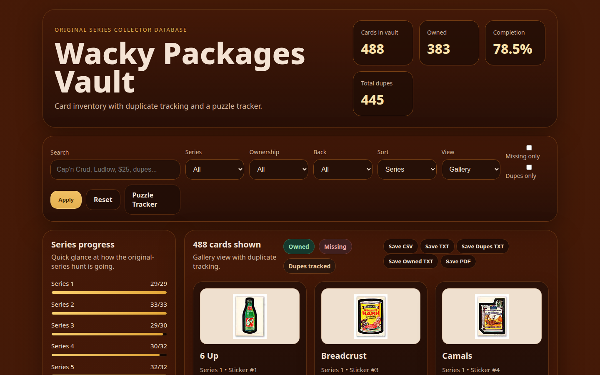
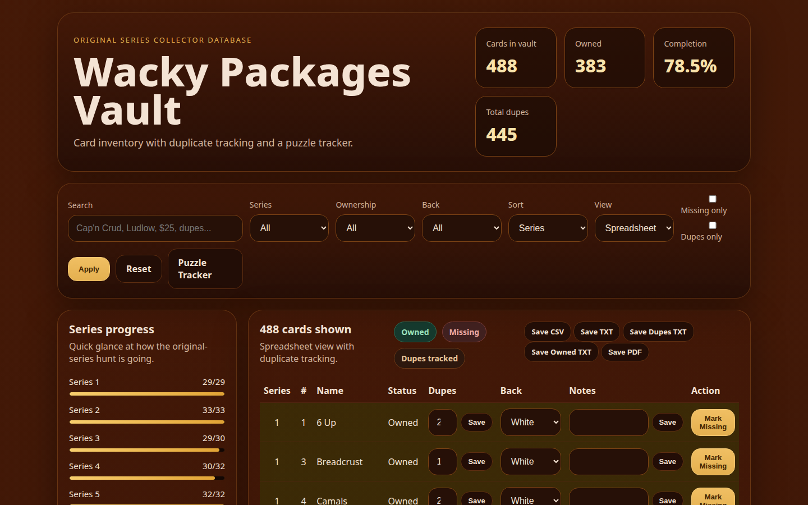
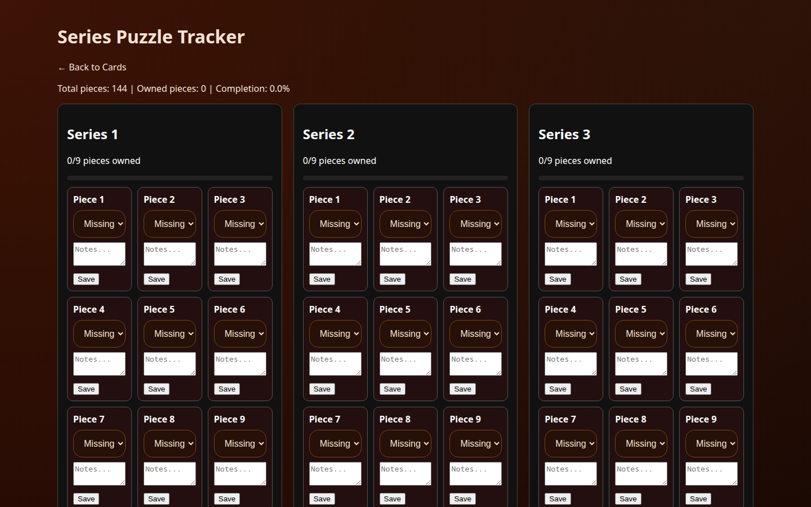

# Wacky Packages Vault

A self-hosted Flask app for tracking a personal collection of original-series
Wacky Packages stickers: 488 cards across 16 series, plus the 16-series jigsaw
puzzle-back set (9 pieces per series, 144 pieces total). Data lives in a
single SQLite file (`wacky_packages.db`) that's tracked in this repo.

## Screenshots

**Gallery view**


**Spreadsheet view**


**Puzzle tracker**


## Getting started

### Requirements

- Linux, macOS, or WSL (anywhere `bash` and `python3` are available)
- Python 3.9+ with the `venv` module (on Debian/Ubuntu: `apt install python3-venv`)
- No external database server — collection data is a single SQLite file
  committed to the repo

### Clone and run

```bash
git clone git@github.com:jlyle/wacky-clean.git
cd wacky-clean
./run.sh
```

`run.sh` creates a `venv/`, installs Flask into it, and starts the app at
`http://localhost:5050`. Re-running it is safe — it reuses the existing venv.

### Desktop app (no Python required for end users)

Pre-built executables for Linux (Ubuntu and Fedora), Windows, and macOS are
available from the
[latest release](https://github.com/jlyle/wacky-clean/releases/tag/v1.0-desktop) —
download, unzip, and run, no Python install required.

`desktop.py` runs the same Flask app in a background thread and opens it in a
native window via [pywebview](https://pywebview.flowrl.com/) — no browser tab,
no visible port. PyInstaller then bundles that into a single OS-native
executable that friends/family can double-click.

Windows and macOS get their native webview (WebView2 / WKWebView) for free
from the OS. **On Linux**, pywebview needs a GTK+WebKit2 (or Qt) backend
installed first — on Fedora: `sudo dnf install python3-gobject webkit2gtk4.1
gtk3`. Building/running on Linux without it will fail to open a window even
though the Flask app itself starts fine.

The system-installed GTK bindings (`gi`) aren't visible from a normal venv, so
on Linux the venv must be created with `--system-site-packages`:

```bash
rm -rf venv
python3 -m venv --system-site-packages venv
```

Windows/macOS don't need this — a normal venv is fine there.

```bash
source venv/bin/activate
pip install -r requirements-desktop.txt
python3 desktop.py          # run the desktop shell directly, for testing

pyinstaller desktop.spec    # build a standalone executable
```

The build lands in `dist/` — `WackyPackagesVault.app` on macOS,
`WackyPackagesVault.exe` on Windows, `WackyPackagesVault` on Linux. PyInstaller
doesn't cross-compile, so build on each target OS separately.

On first launch, the packaged app copies the seed `wacky_packages.db` into a
per-user, per-OS data directory (`%APPDATA%` on Windows, `~/Library/Application
Support` on macOS, `~/.local/share` on Linux) so each user gets their own
writable collection that survives app updates/reinstalls.

#### Building all platforms via GitHub Actions

Since PyInstaller can't cross-compile, `.github/workflows/build-desktop.yml`
builds Ubuntu, Fedora, Windows, and macOS executables in parallel on
GitHub-hosted runners (the Fedora build runs in a `fedora:latest` container on
the Ubuntu runner, since GitHub doesn't offer native Fedora runners). Trigger
it manually from the repo's **Actions** tab → "Build desktop app" → **Run
workflow**, then download `WackyPackagesVault-linux`,
`WackyPackagesVault-fedora`, `WackyPackagesVault-windows`, and
`WackyPackagesVault-macos` from the
finished run's artifacts.

### File layout

| Path                    | Purpose                                                        |
|--------------------------|-----------------------------------------------------------------|
| `app.py`                 | Flask app: routes, DB access, filtering, exports                |
| `wacky_packages.db`      | SQLite database — cards and puzzle pieces (tracked in git)      |
| `run.sh`                 | Sets up the venv, installs deps, launches the app                |
| `requirements.txt`       | Python dependencies (just `flask`)                               |
| `desktop.py`              | Native-window launcher (pywebview) for the packaged desktop app  |
| `desktop.spec`            | PyInstaller build spec for the desktop executable                |
| `requirements-desktop.txt` | Extra deps for building the desktop app (`pywebview`, `pyinstaller`) |
| `templates/base.html`    | Shared page shell (nav, flash messages)                          |
| `templates/index.html`   | Card list: gallery/spreadsheet views, filters, stats, exports    |
| `templates/card_detail.html` | Single-card detail view with notes editor                    |
| `templates/puzzles.html` | Puzzle-back tracker, grouped by series                           |
| `static/style.css`       | App styling                                                      |
| `static/cards/`          | Card images referenced by `image`/`image_filename` DB columns    |
| `dupes.txt`               | Reference list of known duplicate cards                          |
| `README.txt`              | Legacy install notes for an earlier drop-in patch package         |

## Inventory

Each card tracks:

- **Owned / Missing** status
- **Duplicate count** (also flips the card to owned when set above 0)
- **Back color** (white, tan, red ludlow, black ludlow, cloth)
- **Notes** (free text, editable per card)

Cards are viewable in two layouts:

- **Gallery** — image-first cards with inline forms for back color,
  duplicate count, and owned/missing toggling.
- **Spreadsheet** — dense table with the same fields, better for bulk
  scanning or editing.

A **card detail** page (click a card name/Details) shows the full record and
a larger notes editor.

## Filtering & search

The card list can be filtered and sorted by:

- Free-text search (name, series, sticker number, back color, notes, code)
- Series (1–16)
- Ownership (owned / missing)
- Back color
- "Missing only" / "Duplicates only" checkboxes
- Sort by series+number, name, or duplicate count

## Puzzle tracker

A separate `/puzzles` page tracks the 16-series puzzle-back set independently
from the main cards, with the same owned/missing toggle, duplicate count, and
notes per piece, plus per-series and overall completion stats.

## Statistics

The home page header shows running totals:

- Cards in vault (488)
- Owned count
- Completion percentage
- Total duplicate count

A sidebar shows per-series progress bars (owned/total and %) for all 16
series, and the puzzle tracker shows the same for puzzle pieces.

## Reporting / exports

From the card list, respecting whatever filters are currently applied:

- **Save CSV** — full record dump (series, number, name, status, duplicates,
  back color, code, notes)
- **Save TXT** — plain list of owned/filtered cards, one per line
- **Save PDF** — browser print of the current view

Unfiltered, whole-collection reports:

- **Save Dupes TXT** — every card with duplicates, grouped by series
- **Save Owned TXT** — every owned card, grouped by series, with
  `owned/total` progress and a "complete series" marker when a series is
  fully collected

## Tech

- Flask + SQLite (stdlib `sqlite3`, no ORM)
- Server-rendered Jinja templates, no JS framework
- Card images in `static/cards/`
- Runs as a single-process dev server (`app.run`) on port 5050 — fine for
  local/personal use, not hardened for public hosting

## Image credit

All card images were scraped from http://wackypackages.org — permission pending.
